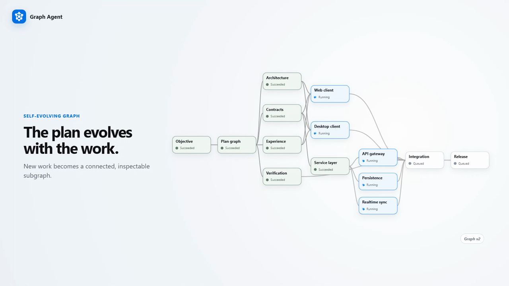

# Graph Agent

> **A graph-based agent that's easier to understand, faster to execute, and smarter by design.**

Graph Agent turns a high-level task into a dynamic directed acyclic graph (DAG). The graph makes execution understandable at a glance, runs independent work concurrently, and adapts its structure when new information changes the work. People are involved only when a decision affects goals, permissions, cost, risk, or irreversible outcomes.

## Demo

[](https://github.com/xingsy97/graph-agent/releases/download/v0.1.0/Graph-Agent-Demo-Final-V4.mp4)

[Watch the full 3-minute replay →](https://github.com/xingsy97/graph-agent/releases/download/v0.1.0/Graph-Agent-Demo-Final-V4.mp4)

The demo replays a completed real run: 37 of 37 tasks succeeded, up to 8 tasks ran concurrently, and 1 hour 43 minutes 55 seconds of recorded task runtime completed in 47 minutes 26 seconds—54% less elapsed time than running those task durations one by one.

> [!IMPORTANT]
> Graph Agent is an experimental developer tool, not a production control plane. Runs are stored in memory, and agent-generated changes must be reviewed before they are published or deployed.

## Highlights

- An understandable execution graph with explicit tasks and dependencies
- Dependency-aware parallel execution with configurable concurrency
- Live progress, status, and run updates over Server-Sent Events
- Runtime graph adaptation when a task reveals additional work
- A decision inbox for high-impact human approvals
- Workspace-aware execution with a final change report
- GitHub Copilot runtime plus an explicit mock mode for UI development

## Requirements

- Node.js 24 or later
- pnpm 11 or later
- GitHub Copilot CLI installed and authenticated for the default runtime

## Quick start

```bash
git clone <repository-url>
cd graph-agent
pnpm install
pnpm dev
```

Create `.env.local` from `.env.example`, then open [http://localhost:3000](http://localhost:3000), choose a workspace, and submit a task.

To develop the interface without Copilot authentication, set `AGENT_RUNTIME=mock` in `.env.local`. Keep tokens and local environment files out of version control.

## Configuration

| Variable | Default | Description |
| --- | --- | --- |
| `AGENT_RUNTIME` | `copilot` | Runtime implementation. Set to `mock` only for local UI development. |
| `COPILOT_MODEL` | `auto` | Optional Copilot model override. Unsupported values fall back to a compatible model. |
| `GITHUB_TOKEN` | unset | Optional server-side GitHub token. Never expose it to client code. |

## Architecture

Graph Agent is a pnpm workspace with a Next.js application and a framework-independent domain package:

```text
apps/web/app/                    Next.js routes and API handlers
apps/web/features/orchestration/ Orchestration UI and feature tests
apps/web/server/                 Runtime, scheduler, store, workspace reporting
apps/web/styles/                 Design tokens and layered component styles
packages/domain/                 Graph, scheduling, and decision domain logic
docs/                            Design, architecture, behavior, and test notes
```

The UI uses React 19, Next.js 16, React Flow, Lucide icons, and native CSS cascade layers. The server owns credentials, Copilot sessions, scheduling, and workspace access. Domain rules remain isolated in `@graph-agent/domain` so persistence and queue implementations can evolve without changing graph semantics.

## Development

| Command | Purpose |
| --- | --- |
| `pnpm dev` | Start the development server |
| `pnpm typecheck` | Type-check every workspace package |
| `pnpm test` | Run domain and UI tests |
| `pnpm build` | Create a production build |
| `pnpm check` | Run all required verification steps |

Before opening a pull request, run:

```bash
pnpm check
```

## Documentation

- [Presentation deck](https://xingsy97.github.io/graph-agent/)
- [System design](docs/design.md)
- [Frontend architecture](docs/frontend.md)
- [Orchestration behavior](docs/orchestration-behavior.md)
- [Orchestration test plan](docs/orchestration-test-plan.md)

## Project policies

- [Contributing guide](CONTRIBUTING.md)
- [Code of Conduct](CODE_OF_CONDUCT.md)
- [Security policy](SECURITY.md)
- [Support policy](SUPPORT.md)

## Roadmap

The current implementation focuses on making agent execution understandable, parallel, and adaptive. Production readiness will require durable persistence, distributed execution leases, authentication and authorization, multi-user isolation, observability, and deployment hardening.

## License

Graph Agent is available under the [MIT License](LICENSE).
