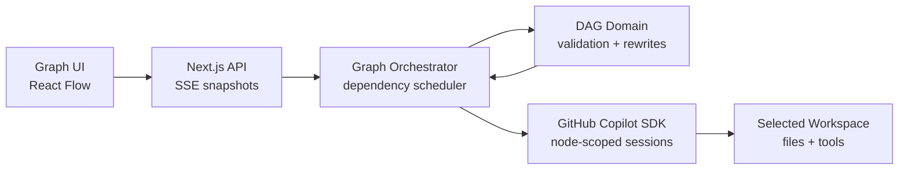

# Graph Agent

## A graph-based agent that's easier to understand, faster to execute, and smarter by design.

<GraphScene variant="overview" />

github.com/xingsy97/graph-agent

<!--
Graph Agent turns an objective into an execution graph you can understand, measure, and control.
Do not explain architecture yet. Let the graph establish the visual language.
-->

---
layout: statement
---

# Agents give you a transcript.

## Not an execution model.

<TranscriptProblem />

<!--
Most agent interfaces answer what was said, not how the work is structured.
When the task becomes complex, three practical questions become hard to answer:
what can run now, what is blocked, and what result unlocks the next step?
-->

---
layout: default
---

# One objective becomes an executable graph.

<GraphScene variant="handoff" />

- **Schedule** only work whose inputs are ready
- **Transfer** completed outputs to their consumers
- **Converge** only after every required branch completes

<!--
This is not a visualization added after execution.
The graph is the execution model: edges gate scheduling and dependency outputs are passed into downstream sessions.
-->

---
layout: default
---

# Easier to understand

<InspectorMock />

<!--
Clicking any task exposes the same information represented here:
its current action, exact prerequisites, downstream work, scoped activity, output, and runtime metadata.
The user does not need to reconstruct this from one long conversation.
-->

---
layout: default
---

# Parallelism is easy. Coordination is not.

<CoordinationComparison />

<!--
Ordinary subagents can run at the same time.
The difference is what happens before, between, and after those runs:
dependency gating, output handoff, convergence, and topology changes.
-->

---
layout: default
---

# Faster — with evidence

<ExecutionTrace />

<!--
The speed metric is based on actual execution intervals.
Serial-equivalent work is the sum of task runtime.
Active execution is the union of those intervals.
Their difference is time genuinely saved through overlap, excluding pauses and human waiting.
Replace the example values with a recorded run before the final presentation.
-->

---
layout: default
---

# The graph changes when the work changes.

<GraphScene variant="rewrite" />

One task discovers independent work → the graph rewrites locally → existing dependencies reconnect automatically.

<!--
This is the strongest product moment.
A running node can replace itself with a validated subgraph.
The old predecessors connect to the new entry, and every new exit reconnects to the old successors.
Unrelated work keeps running.
-->

---
layout: default
---

# Execution continues. Judgment stays with you.

<DecisionMock />

<!--
Low-risk reversible choices are resolved automatically.
Questions involving permission, cost, release, compliance, scope, or irreversible action pause only the affected node.
Independent branches continue.
-->

---
layout: default
---

# A small runtime with explicit guarantees

  Validated DAG rewrites
  Dependency-aware concurrency
  Node-scoped execution context

<!--
Keep this technical explanation under thirty seconds.
The browser renders complete snapshots over SSE.
The orchestrator owns scheduling.
The domain package validates every graph change before it becomes visible.
-->

---
layout: center
class: demo-slide
---

# Let’s run it.

## One objective. Real dependencies. A graph that adapts.

  Plan<i>→</i>Fan out<i>→</i>Rewrite<i>→</i>Converge<i>→</i>Verify

<!--
Switch to the product tab.
Use the prepared release-readiness task.
Show one dependency unlock, one fan-out, one node inspection, one graph rewrite, the saved-time metric, and the final result.
-->

---
layout: center
class: closing-slide
---

# Understand the work.
# Measure the speed.
# Control what matters.

github.com/xingsy97/graph-agent

Graph Agent

<!--
Close by repeating the three concrete product values.
Leave the repository URL visible while taking questions.
-->
