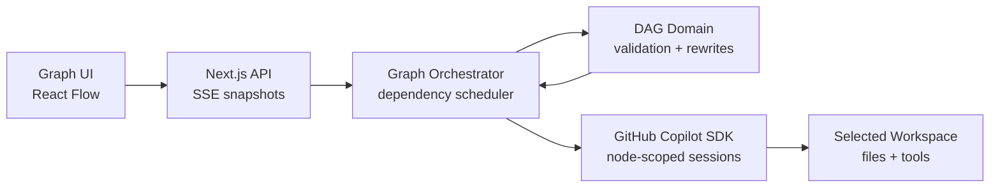

# Graph Agent

## A graph-based agent that's easier to understand, faster to execute, and smarter by design.

<GraphScene variant="overview" />

github.com/xingsy97/graph-agent

<!--
Graph Agent turns an objective into an execution graph you can understand, measure, and control.
Do not explain architecture yet. Let the graph establish the visual language.
-->

---
layout: statement
---

# Complex work does not fit in a linear list.

## Dependencies are oversimplified, and independent tasks are forced to wait.

  <b>01</b> Plan the objective
  <i>↓</i>
  <b>02</b> Design architecture
  <i>↓</i>
  <b>03</b> Build shared contracts
  <i>↓</i>
  <b>04</b> Implement clients
  <i>↓</i>
  <b>05</b> Verify and deliver

<!--
A linear list cannot represent the actual dependency structure of complex work.
Independent tasks appear to wait even when all of their inputs are already available.
-->

---
layout: default
---

# One objective becomes an executable graph.

<GraphScene variant="handoff" />

- **Schedule** only work whose inputs are ready
- **Transfer** completed outputs to their consumers
- **Converge** only after every required branch completes

<!--
This is not a visualization added after execution.
The graph is the execution model: edges gate scheduling and dependency outputs are passed into downstream sessions.
-->

---
layout: default
---

# Easier to understand

<InspectorMock />

<!--
Clicking any task exposes the same information represented here:
its current action, exact prerequisites, downstream work, scoped activity, output, and runtime metadata.
The user does not need to reconstruct this from one long conversation.
-->

---
layout: default
---

# Parallelism is easy. Coordination is not.

<CoordinationComparison />

<!--
Ordinary subagents can run at the same time.
The difference is what happens before, between, and after those runs:
dependency gating, output handoff, convergence, and topology changes.
-->

---
layout: default
---

# Faster — with evidence

<ExecutionTrace />

<!--
This completed real run recorded 1 hour, 43 minutes, and 55 seconds of cumulative task runtime.
Parallel execution completed the run in 47 minutes and 26 seconds.
That is 56 minutes and 29 seconds less elapsed time, a 54 percent reduction compared with running the same observed task durations one by one.
-->

---
layout: default
---

# The graph changes when the work changes.

<GraphScene variant="rewrite" />

One task discovers independent work → the graph rewrites locally → existing dependencies reconnect automatically.

<!--
This is the strongest product moment.
A running node can replace itself with a validated subgraph.
The old predecessors connect to the new entry, and every new exit reconnects to the old successors.
Unrelated work keeps running.
-->

---
layout: default
---

# Execution continues. Judgment stays with you.

<DecisionMock />

<!--
Low-risk reversible choices are resolved automatically.
Questions involving permission, cost, release, compliance, scope, or irreversible action pause only the affected node.
Independent branches continue.
-->

---
layout: default
---

# A small runtime with explicit guarantees

  Validated DAG rewrites
  Dependency-aware concurrency
  Node-scoped execution context

<!--
Keep this technical explanation under thirty seconds.
The browser renders complete snapshots over SSE.
The orchestrator owns scheduling.
The domain package validates every graph change before it becomes visible.
-->

---
layout: center
class: demo-slide
---

# Let’s run it.

## One objective. Real dependencies. A graph that adapts.

  Plan<i>→</i>Fan out<i>→</i>Rewrite<i>→</i>Converge<i>→</i>Verify

<a class="demo-link" href="https://github.com/xingsy97/graph-agent/releases/download/v0.1.0/Graph-Agent-Demo-Final-V4.mp4">Watch the 3-minute replay →</a>

<!--
The published demo is a replay of a completed real run.
It shows planning, parallel execution, graph evolution, inspection tools, measured results, and the delivered Todo product.
-->

---
layout: center
class: closing-slide
---

# Easier to understand.
# Faster to execute.
# Smarter by design.

github.com/xingsy97/graph-agent

Graph Agent

<!--
Close with the same three product values used in the application and video.
Leave the repository URL visible while taking questions.
-->
