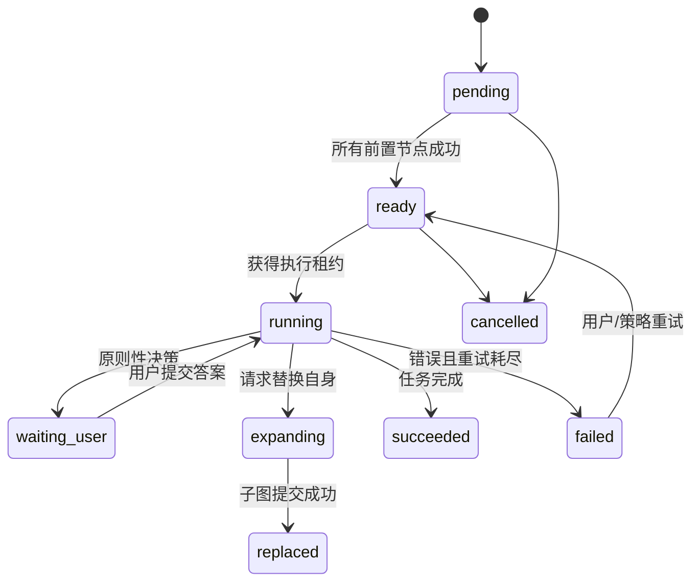
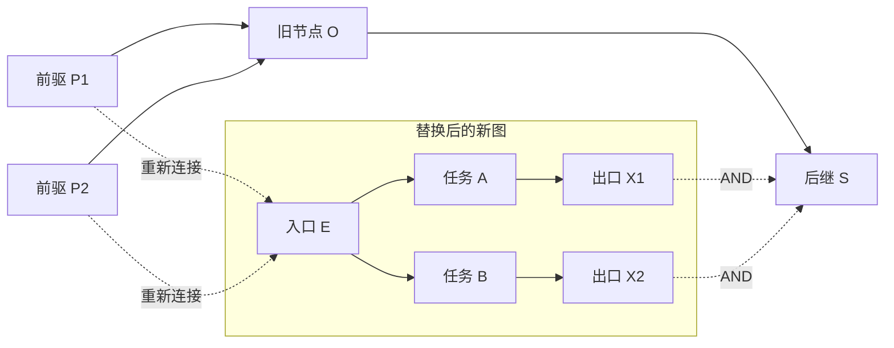
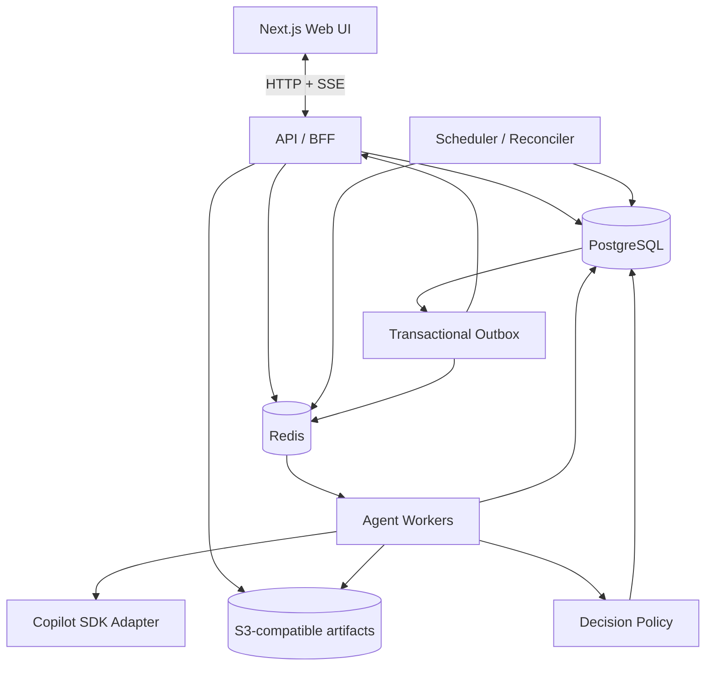

# Graph Agent 设计文档

> 状态：Draft v0.1
> 目标：构建一个由 GitHub Copilot SDK 驱动、以动态 DAG 编排任务、默认由 AI 自主决策并在关键问题上请求用户介入的 Web 应用。

## 1. 产品概述

用户输入一个高层任务，系统首先生成一张有向无环任务图（DAG）。图中的每个节点代表一个可独立执行的任务，有向边 `A -> B` 表示 B 必须等待 A 完成。系统持续调度所有依赖已满足的节点，并为每个节点维护一个 GitHub Copilot Agent Session。

节点在执行中可以把自己细化成一张新的子图。系统以原子操作用新图替换旧节点，并将新图重新接入原有上下游关系。Agent 遇到普通选择时由 AI 自动作出推荐决策；只有涉及目标、权限、风险、成本或不可逆影响的原则性问题，才暂停相应节点并请求用户处理。

## 2. 目标与非目标

### 2.1 目标

- 将自然语言任务拆成可观察、可并行执行的 DAG。
- 支持节点级 Agent Session，保存上下文并可暂停、恢复和重试。
- 支持运行时节点展开（node expansion）和图版本管理。
- 默认自动解决低风险问题，减少不必要的人机交互。
- 将真正需要用户负责的决策集中显示在右侧决策面板。
- 在服务重启、浏览器断开或 Worker 崩溃后恢复任务状态。
- 提供完整的操作、决策和图变化审计记录。

### 2.2 MVP 非目标

- 通用 BPMN 编辑器。
- 任意循环图；首版只允许 DAG。
- 跨组织的复杂 RBAC 和计费系统。
- 同一项目多人实时协同编辑。
- 完全依赖浏览器进程维持 Agent Session。

## 3. 核心概念

| 概念 | 含义 |
| --- | --- |
| Run | 用户一次顶层任务的完整执行实例 |
| Graph | 某个 Run 当前生效的任务图 |
| Node | 一个可调度任务及其 Agent Session |
| Edge | `from -> to`，表示 to 依赖 from |
| Agent Session | Node 背后的 Copilot 会话及其上下文引用 |
| Decision Request | Agent 请求外部提供选择或文本输入 |
| Graph Patch | Node 用新子图替换自身的原子变更 |
| Reconciler | 周期性检查实际状态并推进期望状态的调度器 |

## 4. 用户体验

### 4.1 页面布局

- 顶部：任务输入、Run 状态、暂停/继续/取消。
- 中间主区域：可缩放 DAG，显示节点状态、进度、耗时和依赖。
- 右侧面板：按优先级排列的用户决策 Card。
- 底部或抽屉：选中节点的 Agent 日志、工具调用、产物和变更历史。

节点建议使用以下视觉状态：

| 状态 | UI 表现 |
| --- | --- |
| `pending` | 灰色 |
| `ready` | 蓝色描边 |
| `running` | 蓝色动画 |
| `waiting_user` | 琥珀色、带决策图标 |
| `expanding` | 紫色动画 |
| `succeeded` | 绿色 |
| `failed` | 红色 |
| `cancelled` | 删除线/暗灰 |
| `replaced` | 淡化，仅在历史视图显示 |

### 4.2 决策 Card

每张 Card 至少展示：

- 哪个节点正在等待，以及阻塞了哪些后继任务。
- 问题背景和必须由用户处理的原因。
- 结构化选项或自由文本输入。
- AI 推荐项、理由、风险和影响范围。
- 是否不可逆、是否涉及外部发布或预计成本。
- 提交、取消节点；必要时允许“修改后提交”。

用户提交后，答案写入同一个 Agent Session，节点从 `waiting_user` 回到 `running`。其他不依赖该节点的分支继续运行。

## 5. 节点与状态机



`waiting_user` 不占用 Worker 执行槽，也不保持数据库事务或 HTTP 连接；会话通过持久化的 session reference 在恢复时继续。

## 6. DAG 调度模型

### 6.1 可运行条件

节点 N 可进入 `ready`，当且仅当：

1. N 当前为 `pending`；
2. N 所属 Run 为 `running`；
3. 所有入边的源节点均为 `succeeded`；
4. N 没有未处理的决策请求；
5. N 未被取消或替换。

默认依赖语义为 AND：所有前置节点成功才启动。前置节点失败时，后继节点保持阻塞，并在 UI 中解释阻塞原因。未来可以增加 `ALL_SUCCESS`、`ANY_SUCCESS` 等依赖策略，但不进入 MVP。

### 6.2 一秒轮询与事件驱动

保留用户提出的每 1 秒 poll，但将它实现为“兜底 Reconciler”，而不是唯一触发机制：

- 节点完成、决策恢复和图替换后立即发布事件，低延迟推进后继节点。
- 每秒扫描可能遗漏或租约过期的节点，保证最终一致性。
- 多个 Scheduler 实例通过数据库锁或原子状态更新竞争任务，避免重复启动。
- Worker 使用带过期时间的 execution lease；崩溃后由 Reconciler 回收。

核心领取操作应类似：只允许一个 Worker 原子地把指定节点从 `ready` 改为 `running`，并写入 `lease_owner` 和 `lease_expires_at`。所有副作用需使用幂等键 `run_id/node_id/attempt`。

### 6.3 并发与限流

- 全局 Worker 并发上限。
- 每个 Run 并发上限。
- 每个用户/仓库并发上限。
- Copilot SDK 调用单独限流和指数退避。
- 支持 Run 级暂停；已运行节点可选择完成当前安全点后暂停。

## 7. 动态图替换

### 7.1 Graph Patch 输入

一个运行中的节点可以返回：

```typescript
type ReplaceNodePatch = {
  expectedGraphVersion: number;
  replacedNodeId: string;
  entryNodeId: string;
  newGraph: {
    nodes: NewNode[];
    edges: NewEdge[];
  };
};
```

`replacedNodeId` 必须是发起操作的节点，避免 Agent 修改无权修改的图区域。`entryNodeId` 必须属于 `newGraph`。

### 7.2 替换语义

设旧节点为 O，旧前驱集合为 P，旧后继集合为 S，新图为 G，入口为 E，新图所有出度为 0 的节点组成出口集合 X：

1. 校验 G 非空、节点 ID 不冲突、E 存在。
2. 校验 G 是 DAG，且 G 中所有节点都能从 E 到达。
3. 将每条 `P -> O` 改为 `P -> E`。
4. 导入 G 的节点和边。
5. 对每个出口 `x in X` 和每个旧后继 `s in S`，创建 `x -> s`。
6. 将 O 标记为 `replaced`，保留历史但不再参与调度。
7. 递增 `graph_version`，在同一数据库事务内提交。

因此多个出口采用 AND 语义：它们全部成功后，旧后继节点才可运行。若某些新分支不应阻塞后继，Agent 必须显式增加一个汇合节点或在未来版本中使用条件依赖。



由于 O 只有在其前置依赖已经成功后才可能运行，`P -> E` 主要用于保留完整拓扑和审计语义。

### 7.3 并发安全

- 使用 `expectedGraphVersion` 做乐观并发控制。
- Patch 提交前锁定 Run/Graph 记录并重新校验 DAG。
- 图替换与调度领取不能同时对同一图版本成功。
- 每个 Patch 有唯一 `operation_id`，重复提交返回首次结果。
- 限制展开深度、单次新增节点数和 Run 总节点数，防止递归爆炸。

建议初始限制：单次最多 50 个节点、Run 最多 1,000 个活跃节点、展开深度最多 20；均可配置。

## 8. Agent Session 与决策治理

### 8.1 Copilot 适配层

不要让业务代码直接依赖 SDK 的具体事件名或会话对象。定义内部接口：

```typescript
interface AgentRuntime {
  createSession(input: SessionInput): Promise<SessionRef>;
  run(session: SessionRef, task: NodeTask): AsyncIterable<AgentEvent>;
  resume(session: SessionRef, answer: DecisionAnswer): AsyncIterable<AgentEvent>;
  cancel(session: SessionRef): Promise<void>;
}

type AgentEvent =
  | { type: "progress"; message: string }
  | { type: "artifact"; artifact: ArtifactRef }
  | { type: "decision_requested"; request: RawDecisionRequest }
  | { type: "replace_node"; patch: ReplaceNodePatch }
  | { type: "completed"; result: unknown }
  | { type: "failed"; error: SerializedError };
```

具体 GitHub Copilot SDK 的包名、认证方式、session 恢复能力、流式事件和工具注册 API，应在开发开始时用当前官方文档做一次 spike 验证。若 SDK 不能跨进程恢复 session，适配器需保存可重放 transcript，并在恢复时重建上下文。

### 8.2 决策分级

Agent 请求输入后，先经过 Decision Policy，而不是直接展示给用户：

| 等级 | 示例 | 行为 |
| --- | --- | --- |
| L0 信息不足但可推断 | 命名、格式、小型实现细节 | AI 自动补全 |
| L1 可逆低风险选择 | 库内实现方案、测试组织方式 | AI 选择推荐项并记录 |
| L2 有明显影响但在授权范围内 | 较大重构、性能/开发速度取舍 | AI 默认决策；低置信度可升级 |
| L3 原则性问题 | 目标/范围改变、权限、秘密、付费、删除数据、对外发布、法律合规、不可逆操作 | 必须用户决定 |

无论 Agent 多有信心，以下类别都不得自动批准：

- 扩大用户给定的任务目标或修改验收标准。
- 获取新权限、访问凭证或敏感数据。
- 不可恢复的数据删除、覆盖或历史改写。
- 产生显著费用或创建持续付费资源。
- 向外部人员/系统发送信息、发布或部署到生产。
- 法律、合规、安全边界和业务价值取舍。
- 多个合理选项代表不同产品意图，且无法从上下文推断。

### 8.3 自动决策规则

Decision Policy 采用“确定性规则优先，模型判断补充”：

1. 先根据操作类型、工具权限、资源和关键词匹配硬规则。
2. 再让独立的 decision evaluator 输出结构化结果：风险等级、置信度、推荐答案和理由。
3. L0-L2 且置信度达到阈值时自动回答原 Session。
4. L3 或低置信度时创建 `decision_request` 并将节点设为 `waiting_user`。
5. 所有自动选择和用户选择都写入审计日志。

不要仅依靠 Agent 自己判断问题是否原则性，因为它同时承担执行目标。规则引擎和 evaluator 应是调度层的独立防线。

### 8.4 等待和恢复

- Decision Request 使用唯一 ID，只能解决一次。
- 用户答案提交时校验节点仍在等待同一请求。
- 等待期间可设置提醒，但原则性问题不得超时后自动批准。
- Run 取消时关闭未决 Card，并尝试取消对应 Session。
- Session 恢复失败时，通过 transcript 和节点上下文创建替代 Session，并明确记录。

## 9. 系统架构



### 9.1 组件职责

- Web UI：图可视化、节点详情、日志流和决策 Card。
- API/BFF：认证、Run/Graph/Decision API、SSE 推送。
- Scheduler：计算 ready 节点、回收过期租约、执行 1 秒 reconciliation。
- Worker：运行和恢复 Agent Session，处理事件和产物。
- Decision Policy：自动回答或升级用户。
- PostgreSQL：任务、图、状态、决策和审计的唯一事实来源。
- Redis：工作队列、短期事件分发和限流；不能作为最终状态来源。
- Object Storage：大型日志、补丁、生成物和附件。
- Transactional Outbox：保证数据库状态变更后事件最终会发布。

## 10. 推荐技术栈

### 10.1 MVP 推荐

| 层 | 技术 | 原因 |
| --- | --- | --- |
| 语言 | TypeScript（strict） | 前后端共享类型，适合 SDK 和事件模型 |
| Monorepo | pnpm workspaces + Turborepo | 管理 Web、Worker、共享协议和适配器 |
| Web/BFF | Next.js（App Router） | 快速完成产品 UI、鉴权和常规 API |
| 独立服务 | Fastify | Scheduler/Worker 健康检查及内部接口轻量 |
| 图 UI | React Flow / `@xyflow/react` | 成熟的节点、边、布局和交互能力 |
| 自动布局 | ELK.js | DAG 分层布局和复杂边路由较好 |
| 客户端状态 | TanStack Query + Zustand | 服务端缓存与局部交互状态职责清晰 |
| 实时通信 | SSE | 主要是服务端到浏览器事件，恢复与部署比 WebSocket 简单 |
| 数据库 | PostgreSQL | 事务、行锁、JSONB、递归查询和可靠持久化 |
| ORM | Drizzle ORM | 类型安全且接近 SQL，便于精确控制锁与事务 |
| 队列 | Redis + BullMQ | MVP 上手快，支持延迟、重试、并发和事件 |
| Agent | GitHub Copilot SDK + 内部 Adapter | 隔离 SDK 变化和 session 恢复差异 |
| Schema | Zod | API、Agent 工具参数和事件统一校验 |
| 日志/追踪 | OpenTelemetry + Pino | 串联 Run、Node、Attempt、Session 和工具调用 |
| 测试 | Vitest + Playwright + Testcontainers | 单元、UI 和真实数据库/Redis 集成测试 |
| 本地开发 | Docker Compose | 一键启动 PostgreSQL、Redis 和对象存储 |
| 部署 | Docker；Web 与 Worker 分开扩缩容 | 长任务不能绑定 Serverless 请求生命周期 |

### 10.2 为什么不建议首版直接上 Temporal

Temporal 很适合耐久工作流、等待用户和故障恢复，但本系统的图会由 Agent 高频动态替换，自定义图版本与调度可视化本身又是核心产品能力。首版采用 PostgreSQL 状态机 + BullMQ 更直接，也更容易观察每一次图变化。

当出现以下需求时，再评估将节点执行迁移到 Temporal：跨天/跨月工作流规模显著增加、补偿事务复杂、定时器数量巨大、团队难以维护自研 lease/retry/recovery。即使迁移，产品 Graph 仍建议保留在 PostgreSQL，Temporal 只承担耐久执行。

### 10.3 SSE 与 WebSocket 的选择

MVP 使用 SSE 推送节点状态、日志摘要和决策变化，用户操作继续走普通 HTTP。只有需要多人协同编辑、双向低延迟控制或超高频事件时再换 WebSocket。日志事件应批量合并（例如每 100–250ms 一批），避免每个 token 都触发 UI 重绘。

## 11. 数据模型（建议）

### 11.1 核心表

- `runs`：顶层任务、状态、配置、当前 graph version。
- `graph_nodes`：节点定义、状态、深度、替换关系、时间戳。
- `graph_edges`：from/to、依赖策略、创建版本、删除版本。
- `node_attempts`：每次执行、Worker lease、session ref、错误和结果。
- `agent_events`：标准化后的 Agent 事件序列。
- `decision_requests`：问题、选项、推荐、风险、状态和答案。
- `graph_operations`：Graph Patch、operation ID、前后版本和校验结果。
- `artifacts`：产物元数据及对象存储引用。
- `outbox_events`：待发布的可靠事件。
- `audit_logs`：操作者、动作、理由、关联实体和时间。

关键约束：

- 活跃边 `(run_id, from_node_id, to_node_id)` 唯一。
- 同一节点至多一个活跃 `running` attempt。
- 同一节点至多一个活跃未解决 Decision Request。
- 所有行携带 `run_id`，便于隔离和查询。
- 不硬删除被替换节点和旧边，使用版本区间保留历史。

## 12. API 草案

```text
POST   /api/runs                         创建任务并生成初始图
GET    /api/runs/:runId                  获取 Run 摘要
GET    /api/runs/:runId/graph            获取当前或指定版本图
POST   /api/runs/:runId/pause             暂停 Run
POST   /api/runs/:runId/resume            恢复 Run
POST   /api/runs/:runId/cancel            取消 Run
GET    /api/runs/:runId/events            SSE 事件流
GET    /api/nodes/:nodeId                 获取节点详情
POST   /api/nodes/:nodeId/retry           重试失败节点
POST   /api/decisions/:decisionId/answer  提交用户答案
```

Agent 可调用的内部工具：

- `report_progress`
- `publish_artifact`
- `request_decision`
- `replace_self_with_graph`
- `complete_task`

所有工具输入使用 Zod/JSON Schema 校验。`replace_self_with_graph` 只提交意图，真正的鉴权、DAG 校验和事务提交由 Orchestrator 完成。

## 13. 可靠性与一致性

- PostgreSQL 是状态唯一事实来源，队列消息可重复、必须幂等消费。
- 使用 outbox pattern 避免“数据库已提交、事件未发送”。
- Agent 事件按 `(attempt_id, sequence)` 去重和排序。
- Worker 定期续租；超过租期的 `running` 节点由 Reconciler 判定重试或失败。
- 外部副作用必须记录 idempotency key；未知结果不得盲目重试。
- 图操作写入前后版本，支持只读时间旅行和故障诊断。
- Run 完成条件：所有未被替换的叶子节点都进入终态，且不存在 `pending/ready/running/waiting_user/expanding` 节点。

## 14. 安全边界

- Copilot Session 的工具使用最小权限，并按 Run 隔离工作目录和凭证。
- 密钥只保存在服务端 Secret Manager，不进入 prompt、日志或浏览器。
- 对 shell、文件写入、网络、部署和外部消息工具分别授权。
- Agent 生成的 Graph Patch、工具参数和 UI 文本均视为不可信输入。
- 限制日志中的敏感信息，并对 artifact 下载做权限校验。
- 用户决策提交必须防 CSRF、做权限检查并写审计日志。
- 对 prompt injection 采用工具权限边界和数据来源标记，不能只靠 system prompt。

## 15. 可观测性

每条日志和 trace 至少关联：`user_id`、`run_id`、`graph_version`、`node_id`、`attempt_id`、`session_id`、`decision_id`（适用时）。

核心指标：

- ready 到 running 的调度延迟。
- 节点成功率、重试率和平均耗时。
- Session 恢复成功率。
- 自动决策率、人工升级率和用户等待时长。
- Graph Patch 校验失败率及每次展开规模。
- Worker lease 过期数、队列积压和 SSE 重连数。

## 16. 测试策略

- 单元测试：状态机、ready 判定、决策分级、图替换和环检测。
- 性质测试：随机生成 DAG 和 Patch，验证替换后仍为 DAG、无孤立节点且连接语义正确。
- 集成测试：PostgreSQL 锁、Worker 重复消费、outbox、租约过期和 session 恢复。
- 契约测试：Copilot Adapter 的标准事件映射。
- E2E：创建 Run、并行节点、人工决策、恢复 Session、动态展开和最终完成。
- 故障注入：Worker 在 SDK 调用中退出、事件重复、Redis 短暂不可用、浏览器断线。

## 17. 建议仓库结构

```text
apps/
  web/                 Next.js UI 与 BFF
  scheduler/           Reconciler 与 outbox publisher
  worker/              Agent Worker
packages/
  domain/              状态机、DAG、决策策略
  db/                  Drizzle schema 与 migrations
  contracts/           Zod schema、API 与事件类型
  copilot-adapter/      GitHub Copilot SDK 隔离层
  observability/       logging、metrics、tracing
  ui/                   共用 UI 组件
infra/
  docker/
docs/
  design.md
```

## 18. 分阶段实施计划

### Phase 0：技术验证（2–3 天）

- 验证当前 Copilot SDK 的认证、会话生命周期、流式事件和工具调用。
- 验证 Session 暂停后能否跨进程恢复；记录 fallback 方案。
- 用一个最小 Agent 调用 `request_decision` 和 `replace_self_with_graph`。

退出标准：明确 Adapter 接口和 SDK 能力差距，不把未知能力带入核心架构。

### Phase 1：DAG 核心（约 1 周）

- 建立 monorepo、PostgreSQL schema 和领域状态机。
- 完成初始图创建、DAG 校验、ready 计算和节点领取。
- 完成 Graph Patch 原子替换及并发测试。

### Phase 2：Agent 执行（约 1 周）

- 接入 Copilot Adapter、BullMQ Worker、重试和 lease。
- 实现 Agent 标准事件、日志和 artifact。
- 实现事件触发调度与每秒 Reconciler。

### Phase 3：Web UI 与人工决策（约 1 周）

- React Flow 图、节点详情、SSE 状态更新。
- Decision Policy、右侧 Card、回答后恢复 Session。
- Run 暂停、恢复、取消和失败重试。

### Phase 4：可靠性与上线准备（约 1 周）

- Outbox、OpenTelemetry、权限、限流和敏感信息处理。
- E2E、故障注入、负载测试和部署脚本。
- 设置节点/展开/成本限制和运维告警。

## 19. MVP 验收标准

- 输入任务后能生成并展示合法 DAG。
- 无依赖节点能并行执行，依赖节点不会提前启动。
- Scheduler 重启或事件丢失后，1 秒 Reconciler 能继续推进任务。
- 节点可原子替换为子图，旧上下游连接正确且图仍无环。
- 普通选择由 AI 自动回答并留下记录。
- 原则性问题让节点进入 `waiting_user`，右侧出现 Card；回答后原 Session 恢复。
- 等待用户的分支不会阻塞无关分支。
- Worker 崩溃不会导致同一个节点永久卡在 `running`。
- 所有状态变化、自动决策、人工决策和图替换可审计。

## 20. 当前设计决策摘要

1. 边方向固定为“前置任务 -> 后续任务”。
2. 依赖默认采用 AND 语义。
3. 调度采用事件驱动 + 每秒 reconciliation。
4. 图替换中，新图所有叶子节点共同连接旧后继。
5. 等待用户只阻塞当前节点及其后继，不阻塞整个 Run。
6. AI 默认处理低风险决策，原则性问题必须由用户决定。
7. MVP 使用 TypeScript、Next.js、React Flow、PostgreSQL、Redis/BullMQ。
8. Agent 能力通过 Adapter 隔离，先验证当前 Copilot SDK 再实现。
9. PostgreSQL 是唯一事实来源，队列和实时消息都允许重复。
10. 首版不引入 Temporal，但为后续耐久执行迁移保留边界。
